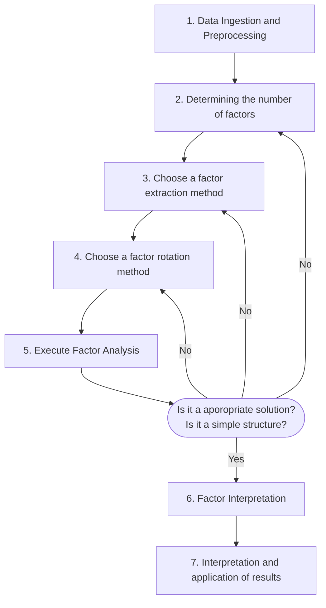

```mermaid
graph TD
  Node1["1. Data Ingestion and Preprocessing"] --> Node2["2. Determining the number of factors"]
  Node2 --> Node3["3. Choose a factor extraction method"]
  Node3 --> Node4["4. Choose a factor rotation method"]
  Node4 --> Node5["5. Execute Factor Analysis"]
  Node5 --> NodeR(["Is it a aporopriate solution?
Is it a simple structure?"])
  NodeR -- No --> Node2
  NodeR -- No --> Node3
  NodeR -- No --> Node4
  NodeR -- Yes --> Node6["6. Factor Interpretation"]
  Node6 --> Node7["7. Interpretation and application of results"]
```
